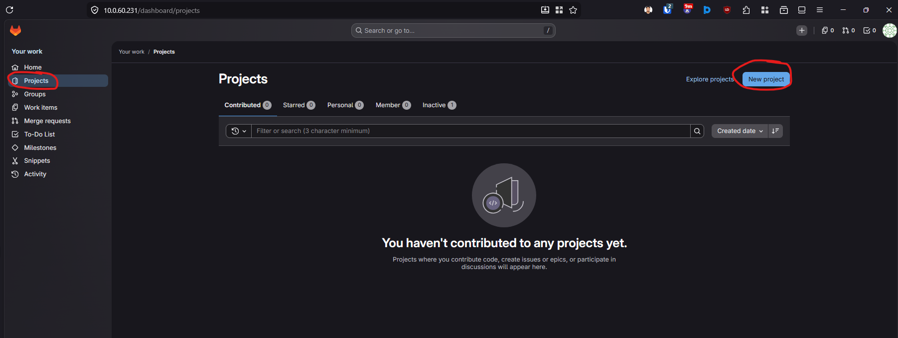
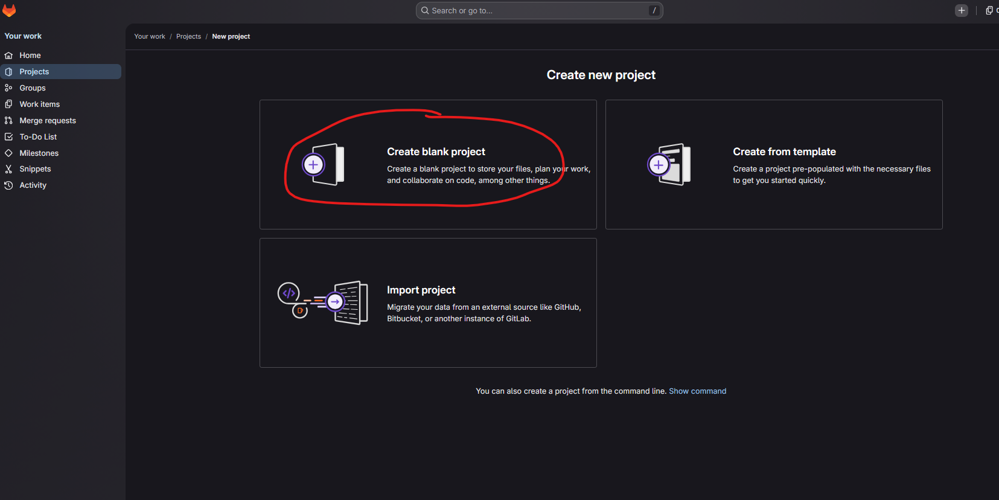
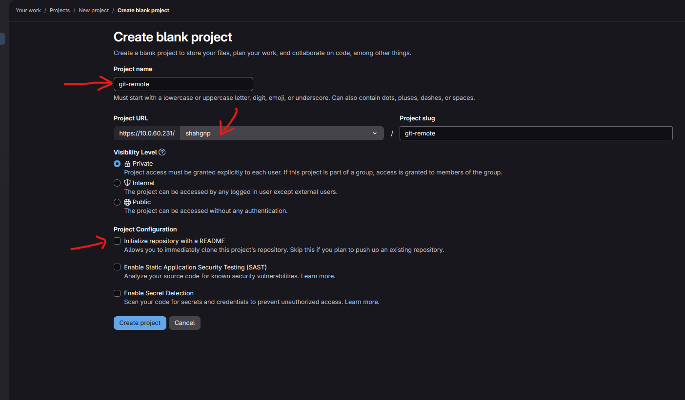

## Explore git remote basics with self hosted GitLab.

### Step 1: Create a project in the GitLab

repo-name: git-remote






Public or private?



### Step 2: Clone the newly created repo

```bash
git clone git-remote
cd git-clone
ls -la # Notice the .git directory
git status # Nothing on branch, working tree is clean
```

### Step 3: Make changes

```
echo "# Build Validation Demo" > README.md
git add README.md
git commit -m "init: initial commit"
```

### Step 4: Push to the repo

```bash
mkdir app
echo "def add(a, b): return a + b" > app/calculator.py
mkdir tests
echo "from app.calculator import add
def test_add():
    assert add(2,3) == 5" > tests/test_calculator.py
echo 'pytest' > requirements.txt
```

Push the changes

```bash
git add .
git commit -m "feat: add simple app and test"
git push
```

Observe that every changes that we make is being pushed to the main repo, which is not good practice. Why?

### Step 5: Clean up (Optional)

Clean the code base
```bash
cd ..
rm -r git-remote
```

Even if the code base is deleted, it is available on the remote (GitLab) until you delete it from the GitLab itself.