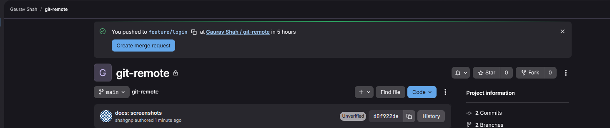
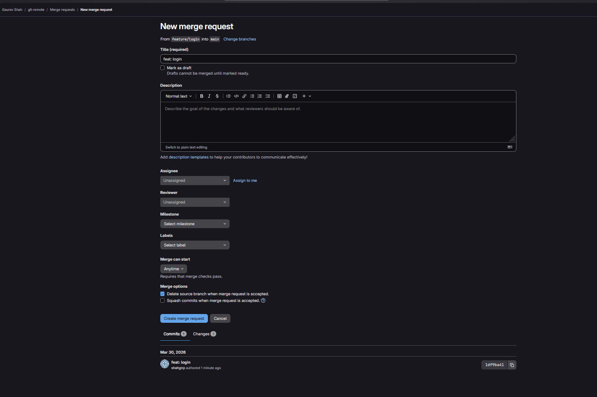
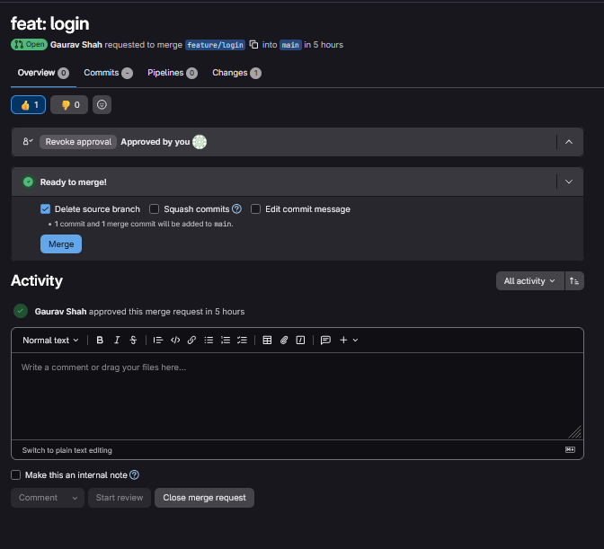

## Explore git remote PR

### Step 1: Clone an existing repo from the previous lab

```bash
git clone <url>
cd git-remote
```

### Step 2: Make Create a new branch and make changes on the local repo

Create a new branch
```bash
git checkout -b feature/login
```

Make changes to the new branch
```bash
echo "This is a feature/login branch file" >> login-file.txt
git add .
git commit -m "feat: login"
```

Push the changes
```bash
git push origin feature/login # This might produce error, read the logs
```

Again push the changes correctly,
```bash
git push -u origin feature/login
```

### Step 3: Observe the GitLab



### Step 4: Open a pull request

You can read the logs of git as well

or refer gitlab GUI



### Step 5: Approve the merge request



### Step 6: Pull the new changes on the main branch

```bash
git checkout main
git pull
```